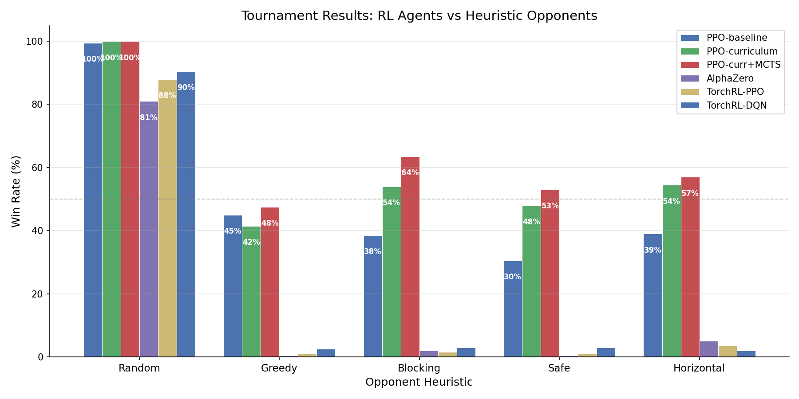
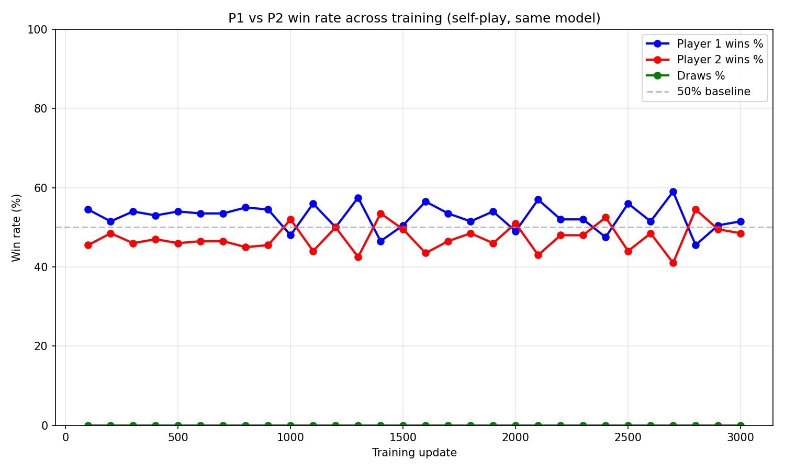
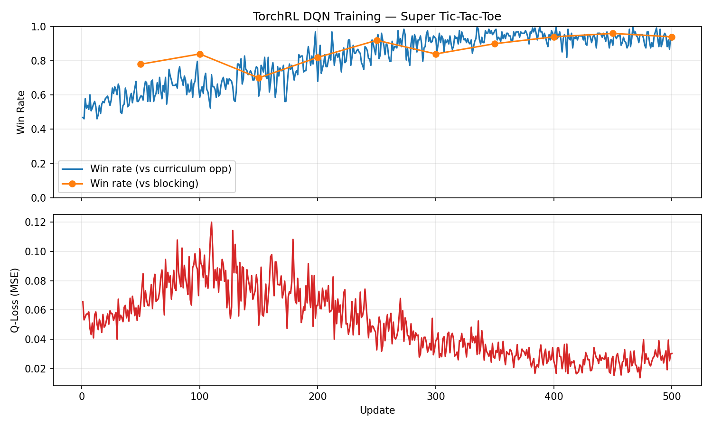
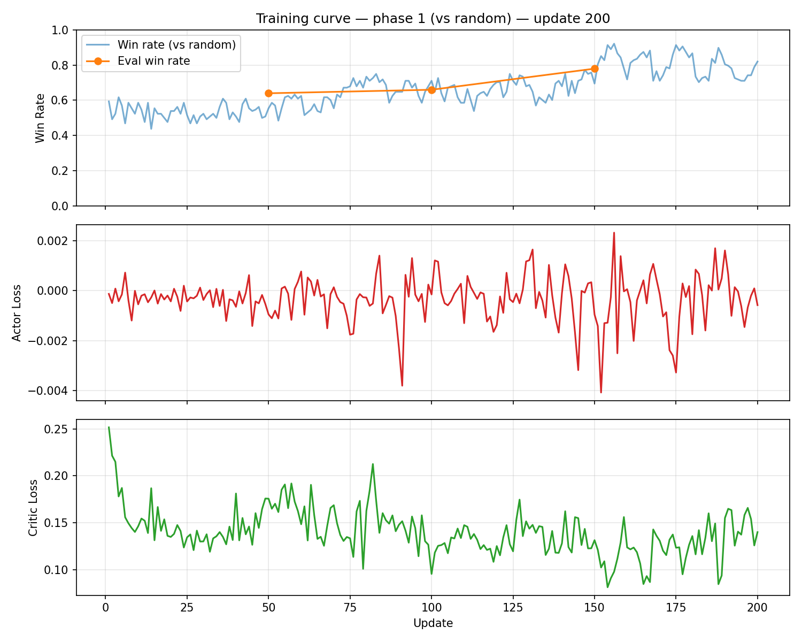
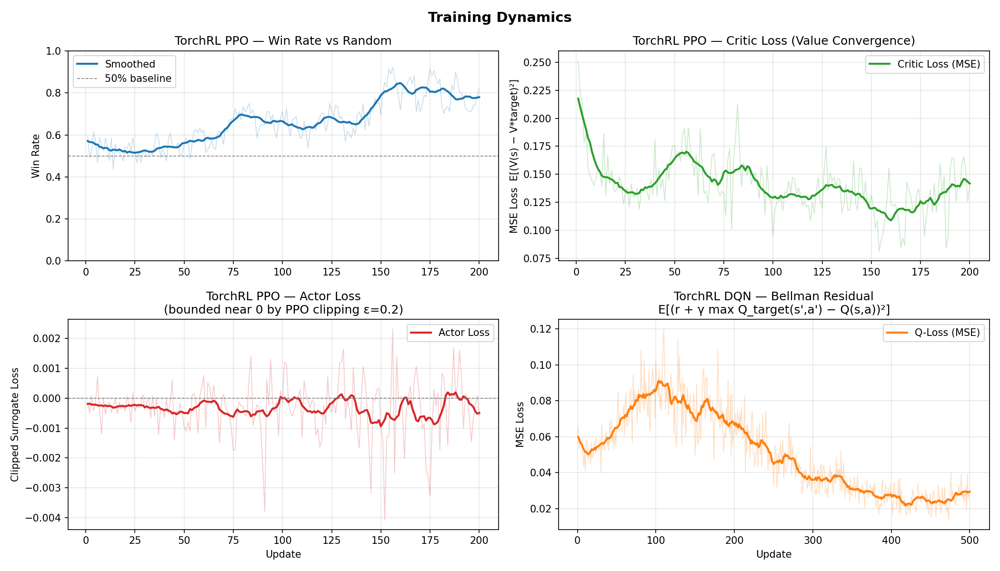
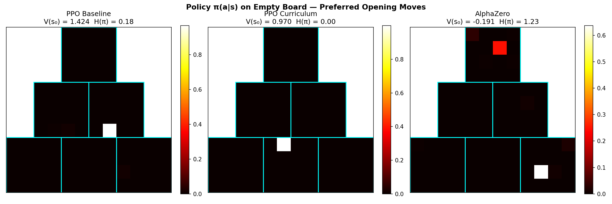
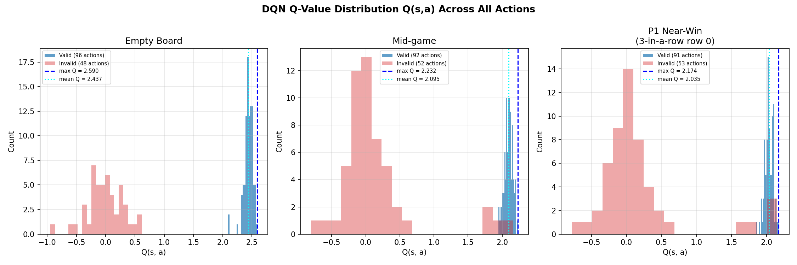

# Super Tic-Tac-Toe — RL Agent

## Problem Description

The game is almost the same as tic-tac-toe, but you have to get 4 in a row, or in a column, or 5 across the
diagonal to win. To win with 4 in a column, at least one move must be in a different level.
- The board is of the shape of a triangle, comprising of 6 squares, with each square of 4 x 4 size.
- Player one and player two take turns to choose an empty square to place noughts and crosses respectively.
- After a player chooses an empty square, there is only ½ chance that his nought or cross is placed at the
chosen square. If the player’s choice is not accepted, the player’s move is selected randomly with probability
1/16 by the computer from the 8 random squares adjacent to the chosen one, with the boundaries ignored. If
the random choice is occupied or outside of the board, the player’s move is forfeited. For example, if the
chosen square is at the corner, with probability 5/16 the randomly selected square is outside of the board.
- Train an RL agent to play this game.
- Bonus: if you can implement this using TF Agent of Tensorflow, or TorchRL, or RLLib, your score is multiplied
by 1.5 capped at 50%

A variant of tic-tac-toe played on a **triangular board** comprising 6 sub-squares (each 4x4), arranged across 3 levels:
- Level 1: 1 square (top)
- Level 2: 2 squares (middle)
- Level 3: 3 squares (bottom)

**Win conditions:**
- 4 in a row (horizontal)
- 4 in a column (must span at least 2 levels)
- 5 across a diagonal

**Stochastic placement:** When a player chooses a cell, there is only a **1/2 chance** it lands there. Otherwise, one of the 8 adjacent cells is selected uniformly at random (1/16 each). If the randomly selected cell is occupied or outside the board, the move is **forfeited**.

## Approaches

### 1. PPO with Self-Play (Baseline)

A Proximal Policy Optimization agent trained via **pure self-play** with an opponent pool of past checkpoints.

- **Model:** 2-layer CNN (3→32→64) + FC 256 → actor (144) + critic (1)
- **State:** 3-channel 12x12 (my pieces, opponent pieces, valid empty cells)
- **Action masking:** Invalid actions masked to `-inf` before softmax
- **Reward shaping:** Potential-Based Reward Shaping (PBRS) based on longest unblocked line
- **Training:** 3000 updates, 512 episodes/update, opponent pool (10 past checkpoints)

### 2. PPO with Curriculum Learning

Same architecture as baseline, enhanced with:
- **Curriculum:** `success_rate` decreases from 1.0 (deterministic) → 0.8 → 0.5 (full stochasticity) across training
- **Heuristic opponents:** Trains against a mix of greedy, blocking, safe, and counter-heuristic agents
- **Defense reward shaping:** Penalizes allowing opponent threat growth

### 3. PPO-curriculum + MCTS (Best Agent)

Combines the PPO-curriculum network with Monte Carlo Tree Search at inference time:
- **Deterministic planning:** Tree search uses `success_rate=1.0` internally for consistent state transitions, solving the key challenge of MCTS in stochastic games
- **25 simulations per move** with UCB selection guided by the PPO-curriculum policy and value estimates
- **No additional training required** — purely an inference-time enhancement

This produced the **strongest agent** (64% vs Blocking, 57% vs Horizontal). The insight: MCTS works in stochastic games if you plan deterministically and rely on a well-trained value function to handle uncertainty.

### 4. AlphaZero (MCTS + Self-Play)

AlphaZero-style training using Monte Carlo Tree Search:
- **MCTS:** 50 simulations per move with UCB selection
- **Training targets:** MCTS visit-count policies + game outcomes (±1)
- **Self-play only:** No heuristic opponents

**Result:** Underperformed compared to PPO-curriculum. Pure self-play without opponent diversity led to narrow strategies. Additionally, the model was trained before the deterministic-planning fix was applied, so training data was generated from inconsistent tree statistics — producing unreliable value estimates that search cannot rescue.

### 5. TorchRL PPO (Bonus)

Reimplementation using the **TorchRL framework**:
- `ProbabilisticActor` with `MaskedCategorical` distribution
- `ClipPPOLoss` for policy optimization
- `GAE` (Generalized Advantage Estimation) for value targets
- `TensorDictReplayBuffer` for mini-batch sampling
- Custom `EnvBase` wrapper (`SuperTicTacToeTorchEnv`)

Trained against random opponents only due to time and compute constraints — only 500 updates were run (vs 3000 for the custom PPO), with no curriculum learning applied. As shown by the PPO results, curriculum learning (opponent diversity + gradual stochasticity) is critical for generalising beyond random opponents; without it, agents fail to develop robust strategies against stronger heuristics.

### 6. TorchRL DQN (Bonus)

Value-based approach using TorchRL:
- **Double DQN** with target network (updated every 10 steps)
- `TensorDictReplayBuffer` with `LazyTensorStorage` (100k capacity)
- Epsilon-greedy exploration (1.0 → 0.05)
- Curriculum opponents: random → greedy → blocking

Trained against random opponents only due to time and compute constraints — only 500 updates were run, with no curriculum learning applied. The contrast with PPO-curriculum highlights that curriculum learning and opponent diversity are the key factors driving strong performance in this stochastic game.

## Results

Tournament evaluation (200 games per matchup, playing both sides):

| Model | vs Random | vs Greedy | vs Blocking | vs Safe | vs Horizontal |
|-------|-----------|-----------|-------------|---------|---------------|
| **PPO-curr+MCTS** | **100%** | **48%** | **64%** | **53%** | **57%** |
| PPO-curriculum | 100% | 42% | 54% | 48% | 54% |
| PPO-baseline | 100% | 45% | 38% | 30% | 39% |
| AlphaZero | 81% | 0% | 2% | 0% | 5% |
| TorchRL-PPO | 88% | 1% | 2% | 1% | 4% |
| TorchRL-DQN | 90% | 2% | 3% | 3% | 2% |

**Key findings:**
- **PPO-curriculum + MCTS is our strongest agent.** By combining a well-trained value/policy network with tree search (deterministic planning), we achieve 64% vs Blocking and 57% vs Horizontal — the best results in the tournament.
- **MCTS requires deterministic planning in stochastic games.** Standard MCTS breaks when transitions are random (inconsistent tree statistics). Our fix: use `success_rate=1.0` inside the search tree while the real game retains stochasticity.
- **Curriculum learning + opponent diversity** is critical. PPO-curriculum beats most heuristics above 50%, while PPO-baseline (pure self-play) struggles against stronger opponents.
- **MCTS is only as good as its value function.** AlphaZero's model — trained via self-play with the broken stochastic MCTS — has unreliable value estimates, so search cannot rescue it. The same MCTS code dramatically helps PPO-curriculum because its value function is strong.



## Training Curves

### PPO Baseline — Self-play Balance


The chart shows P1 (blue) consistently winning 52-58% while P2 (red) wins 43-50% throughout all 3000 training updates, confirming a **first-mover advantage** in this game — P1 moves first and holds a small but persistent structural edge. This also validates the PPO self-play setup: both players use the same model, so any persistent imbalance reflects the game's inherent asymmetry rather than a training bug.

### TorchRL DQN — Training Curve


The DQN training curve shows two clear phases. The win rate increases monotonically from ~50% to ~90% against the random opponent, while the Q-loss (MSE of the Bellman residual) follows `L = E[(r + γ max_a' Q_target(s',a') - Q(s,a))²]`. The loss spikes to ~0.12 around update 100–150 as the replay buffer fills with increasingly diverse transitions (harder Bellman targets), then decreases steadily to ~0.02 by update 500 — roughly a **6× reduction** — indicating the Q-network is converging toward the fixed point of the Bellman operator. Since the Bellman operator is a γ-contraction in the sup-norm, convergence to Q* is guaranteed given sufficient capacity and exploration.

### TorchRL PPO — Training Curve


The PPO training curve shows three metrics. The win rate increases from ~50% to ~70% over 200 updates with high variance due to the small episode count per update. The actor loss oscillates tightly around zero with small magnitude (±0.004), which is expected — the PPO clipped surrogate objective constrains the probability ratio `r_t(θ) = π_θ(a|s) / π_θ_old(a|s)` to stay near 1, preventing large destructive updates. The critic loss decreases from ~0.25 to ~0.12 over training, reflecting the value network converging toward V^π(s) — still well above zero after 200 updates, consistent with the limited training budget.

### Smoothed Training Dynamics


Smoothing the raw training signals (window=15) reveals the underlying trends more clearly. The PPO win rate grows steadily from ~55% to ~80%, while the critic MSE drops from 0.22 to ~0.12 — a 45% reduction over 200 updates, indicating the value function is progressively better at predicting game outcomes. The actor loss remains bounded within ±0.004 throughout, confirming the PPO clipping constraint is active and preventing policy collapse. For DQN, the Bellman residual drops ~6× from its peak at update 150, consistent with convergence toward Q*.

### Policy Heatmap — Opening Move Preferences


Visualising π(a|s) on the empty board reveals how each agent's learned strategy differs. PPO Curriculum converges to a near-deterministic opening (entropy H(π)=0.00), always playing a single preferred cell — evidence of a fully committed, confident strategy. PPO Baseline retains slightly more spread (H(π)=0.18), reflecting broader self-play exploration. The AlphaZero policy is more distributed (H(π)=1.23), consistent with an agent that has not converged to a strong opening strategy. The value estimate on the empty board V(s₀) also tells a clear story: PPO Curriculum (0.970) and PPO Baseline (1.424) both correctly estimate a winning advantage for the first player, while AlphaZero (−0.191) incorrectly believes it is losing from the start — a direct consequence of the corrupted value function from stochastic MCTS training.

### DQN Q-Value Distribution


The Q-value histograms across three board positions (empty board, mid-game, near-win) show a consistent and meaningful pattern. Valid actions (blue) cluster tightly at high Q-values (~2.4 on empty board, ~2.1 mid-game), while invalid actions (red) spread across negative values (−1.0 to 0.5). This clear bimodal separation confirms that the DQN has successfully learned to distinguish legal from illegal moves purely from game experience — without any explicit rule encoding. The max Q value decreases slightly from empty board (2.590) to near-win (2.174), reflecting the reduced future reward horizon as the game approaches termination.

## Discussion

### Why 50-55% Win Rate is Strong

In a deterministic game, a well-trained agent should win 90%+ against heuristics. However, the **stochastic placement mechanic** fundamentally changes the game's dynamics:

- Each move has only a **50% chance** of landing on the intended cell
- The remaining 50% is split across 8 adjacent cells (6.25% each)
- If the randomly selected cell is **occupied or off-board**, the move is **forfeited entirely**

This means:
1. **No guaranteed execution** — even a theoretically winning move may not land
2. **High forfeit rate** — late-game positions with many occupied neighbours cause frequent forfeits
3. **Positional value shifts** — cells near the board edge or in crowded regions carry higher forfeit risk

Under these conditions, a 50-55% win rate against heuristics that also experience the same stochastic penalty represents genuine strategic superiority. The agent learned to:
- Prefer cells with multiple open neighbours (lower forfeit risk)
- Build redundant threats (multiple partial lines that can each become winning)
- Account for positional risk rather than solely optimising line completion

### Addressing Sparse Rewards

In this game, the only terminal reward is +1 (win) or −1 (loss), received at the end of a game that lasts ~13 steps on average. This creates a **sparse reward problem** — the agent receives no learning signal for the vast majority of transitions, making credit assignment difficult.

We address this with two complementary techniques:

**1. Potential-Based Reward Shaping (PBRS)**

At each step, a shaping reward is added based on the change in a potential function Φ(s):

```
r_shaped = r_terminal + γ·Φ(s') - Φ(s)
```

where Φ(s) measures the longest unblocked line length (normalised to [0,1]) minus a defense-weighted opponent potential:

```
Φ(s) = Φ_own(s) - defense_weight × Φ_opp(s)
```

This gives the agent a dense signal at every step — building toward a win increases Φ and yields positive shaping reward, while allowing the opponent's lines to grow decreases it. Crucially, PBRS preserves the optimal policy of the original sparse-reward MDP (policy invariance theorem), so the agent is not misled toward suboptimal behaviour.

**2. Defense Threat Penalty**

During data collection, an additional penalty is applied whenever the opponent's board potential increases after their move:

```
penalty = −0.3 × max(0, Φ_opp(s') − Φ_opp(s))
```

This penalises the agent retroactively for allowing opponent threat growth, providing an explicit defensive learning signal that PBRS alone does not capture.

Together these two mechanisms convert a sparse, end-of-game signal into a dense per-step reward that guides the agent toward both offensive line-building and defensive threat suppression throughout the game.

### Curriculum Learning vs Pure Self-Play

PPO-baseline (pure self-play) learned to beat random opponents but developed narrow strategies that fail against focused heuristics. PPO-curriculum, trained against diverse opponents with gradually increasing stochasticity, developed generalised robust play. This demonstrates the importance of **opponent diversity** and **curriculum design** in RL for stochastic environments.

### Adapting MCTS for Stochastic Games

Standard MCTS assumes deterministic transitions: action A from state S always leads to state S'. In our game, the same action produces different outcomes due to stochastic placement, which corrupts the tree — child nodes accumulate statistics from inconsistent states, and UCB scores become meaningless.

**The solution:** use deterministic placement (`success_rate=1.0`) inside the search tree for planning, while the real game retains full stochasticity. This ensures:
1. Each child node consistently represents the same state (valid tree structure)
2. UCB statistics are meaningful (comparing like with like)
3. The model's value function handles uncertainty (trained on stochastic games)

**Result:** PPO-curr+MCTS achieves 64% vs Blocking (+10% over raw PPO-curriculum) and 57% vs Horizontal. This demonstrates that tree search and learned value functions are complementary — search provides lookahead, while the value function accounts for stochastic risk.

## Project Structure

```
super_tictactoe/       Core game environment and models
  env.py               Game environment (12x12 board, stochastic placement, win checking)
  model.py             ActorCritic CNN architecture
  heuristics.py        Heuristic opponents (greedy, blocking, safe, horizontal, counter)
  train.py             PPO training loop (self-play + curriculum + opponent pool)
  selfplay.py          Vectorized episode collection
  ppo.py               PPO update with GAE
  mcts.py              MCTS implementation
  alphazero_train.py   AlphaZero training loop
  torchrl_env.py       TorchRL EnvBase wrapper
  gui.py               Pygame visualization utility

torchrl_ppo/           TorchRL PPO implementation (bonus)
torchrl_dqn/           TorchRL DQN implementation (bonus)
alphazero/             AlphaZero checkpoints
ppo_baseline/          PPO self-play results
ppo_curriculum/        PPO curriculum results
compare.py             Tournament evaluation + plotting
tests/                 Unit tests (env, model, PPO, selfplay, torchrl)
```

## How to Run

```bash
# Install dependencies
pip install -r requirements.txt

# Run tournament evaluation
python compare.py --games 200 --out tournament_results.png

# Train PPO with curriculum
python -m super_tictactoe.train --updates 3000 --episodes 512 --curriculum --heuristic-prob 0.3

# Train TorchRL PPO
python torchrl_ppo/torchrl_train.py --num-updates 500 --phase 0 --device mps

# Train TorchRL DQN
python torchrl_dqn/torchrl_dqn_train.py --num-updates 500 --phase 0 --device mps

# Run tests
pytest
```

## TorchRL Bonus

This project uses **TorchRL** (v0.3+) for both PPO and DQN implementations, demonstrating:
- `EnvBase` subclassing with custom observation/action specs
- `ProbabilisticActor` with `MaskedCategorical` for action masking
- `ClipPPOLoss` and `GAE` for policy gradient training
- `TensorDictReplayBuffer` with `LazyTensorStorage` for experience replay
- `TensorDict`-based data flow throughout the training pipeline

## Requirements

- Python 3.11+
- PyTorch >= 2.0
- TorchRL >= 0.3.0
- TensorDict >= 0.3.0
- NumPy, Pygame, Matplotlib
