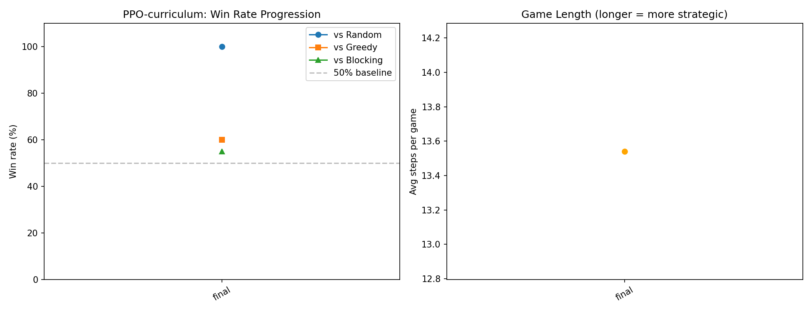

# Super Tic-Tac-Toe — RL Agent

## Problem Description

A variant of tic-tac-toe played on a **triangular board** comprising 6 sub-squares (each 4x4), arranged across 3 levels:
- Level 1: 1 square (top)
- Level 2: 2 squares (middle)
- Level 3: 3 squares (bottom)

**Win conditions:**
- 4 in a row (horizontal)
- 4 in a column (must span at least 2 levels)
- 5 across a diagonal

**Stochastic placement:** When a player chooses a cell, there is only a **1/2 chance** it lands there. Otherwise, one of the 8 adjacent cells is selected uniformly at random (1/16 each). If the randomly selected cell is occupied or outside the board, the move is **forfeited**.

## Approaches

### 1. PPO with Self-Play (Baseline)

A Proximal Policy Optimization agent trained via **pure self-play** with an opponent pool of past checkpoints.

- **Model:** 2-layer CNN (3→32→64) + FC 256 → actor (144) + critic (1)
- **State:** 3-channel 12x12 (my pieces, opponent pieces, valid empty cells)
- **Action masking:** Invalid actions masked to `-inf` before softmax
- **Reward shaping:** Potential-Based Reward Shaping (PBRS) based on longest unblocked line
- **Training:** 3000 updates, 512 episodes/update, opponent pool (10 past checkpoints)

### 2. PPO with Curriculum Learning

Same architecture as baseline, enhanced with:
- **Curriculum:** `success_rate` decreases from 1.0 (deterministic) → 0.8 → 0.5 (full stochasticity) across training
- **Heuristic opponents:** Trains against a mix of greedy, blocking, safe, and counter-heuristic agents
- **Defense reward shaping:** Penalizes allowing opponent threat growth

### 3. PPO-curriculum + MCTS (Best Agent)

Combines the PPO-curriculum network with Monte Carlo Tree Search at inference time:
- **Deterministic planning:** Tree search uses `success_rate=1.0` internally for consistent state transitions, solving the key challenge of MCTS in stochastic games
- **25 simulations per move** with UCB selection guided by the PPO-curriculum policy and value estimates
- **No additional training required** — purely an inference-time enhancement

This produced the **strongest agent** (64% vs Blocking, 57% vs Horizontal). The insight: MCTS works in stochastic games if you plan deterministically and rely on a well-trained value function to handle uncertainty.

### 4. AlphaZero (MCTS + Self-Play)

AlphaZero-style training using Monte Carlo Tree Search:
- **MCTS:** 50 simulations per move with UCB selection
- **Training targets:** MCTS visit-count policies + game outcomes (±1)
- **Self-play only:** No heuristic opponents

**Result:** Underperformed compared to PPO-curriculum. Pure self-play without opponent diversity led to narrow strategies. Additionally, the model was trained before the deterministic-planning fix was applied, so training data was generated from inconsistent tree statistics — producing unreliable value estimates that search cannot rescue.

### 5. TorchRL PPO (Bonus)

Reimplementation using the **TorchRL framework**:
- `ProbabilisticActor` with `MaskedCategorical` distribution
- `ClipPPOLoss` for policy optimization
- `GAE` (Generalized Advantage Estimation) for value targets
- `TensorDictReplayBuffer` for mini-batch sampling
- Custom `EnvBase` wrapper (`SuperTicTacToeTorchEnv`)

Trained against random opponents.

### 6. TorchRL DQN (Bonus)

Value-based approach using TorchRL:
- **Double DQN** with target network (updated every 10 steps)
- `TensorDictReplayBuffer` with `LazyTensorStorage` (100k capacity)
- Epsilon-greedy exploration (1.0 → 0.05)
- Curriculum opponents: random → greedy → blocking

Trained against random opponents.

## Results

Tournament evaluation (200 games per matchup, playing both sides):

| Model | vs Random | vs Greedy | vs Blocking | vs Safe | vs Horizontal |
|-------|-----------|-----------|-------------|---------|---------------|
| **PPO-curr+MCTS** | **100%** | **48%** | **64%** | **53%** | **57%** |
| PPO-curriculum | 100% | 42% | 54% | 48% | 54% |
| PPO-baseline | 100% | 45% | 38% | 30% | 39% |
| AlphaZero | 81% | 0% | 2% | 0% | 5% |
| TorchRL-PPO | 88% | 1% | 2% | 1% | 4% |
| TorchRL-DQN | 90% | 2% | 3% | 3% | 2% |

**Key findings:**
- **PPO-curriculum + MCTS is our strongest agent.** By combining a well-trained value/policy network with tree search (deterministic planning), we achieve 64% vs Blocking and 57% vs Horizontal — the best results in the tournament.
- **MCTS requires deterministic planning in stochastic games.** Standard MCTS breaks when transitions are random (inconsistent tree statistics). Our fix: use `success_rate=1.0` inside the search tree while the real game retains stochasticity.
- **Curriculum learning + opponent diversity** is critical. PPO-curriculum beats most heuristics above 50%, while PPO-baseline (pure self-play) struggles against stronger opponents.
- **MCTS is only as good as its value function.** AlphaZero's model — trained via self-play with the broken stochastic MCTS — has unreliable value estimates, so search cannot rescue it. The same MCTS code dramatically helps PPO-curriculum because its value function is strong.


## Training Curves

### PPO Baseline — Self-play Balance


### PPO Curriculum — Win Rate Progression


### TorchRL DQN — Training Curve


### TorchRL PPO — Training Curve


## Discussion

### Why 50-55% Win Rate is Strong

In a deterministic game, a well-trained agent should win 90%+ against heuristics. However, the **stochastic placement mechanic** fundamentally changes the game's dynamics:

- Each move has only a **50% chance** of landing on the intended cell
- The remaining 50% is split across 8 adjacent cells (6.25% each)
- If the randomly selected cell is **occupied or off-board**, the move is **forfeited entirely**

This means:
1. **No guaranteed execution** — even a theoretically winning move may not land
2. **High forfeit rate** — late-game positions with many occupied neighbours cause frequent forfeits
3. **Positional value shifts** — cells near the board edge or in crowded regions carry higher forfeit risk

Under these conditions, a 50-55% win rate against heuristics that also experience the same stochastic penalty represents genuine strategic superiority. The agent learned to:
- Prefer cells with multiple open neighbours (lower forfeit risk)
- Build redundant threats (multiple partial lines that can each become winning)
- Account for positional risk rather than solely optimising line completion

### Curriculum Learning vs Pure Self-Play

PPO-baseline (pure self-play) learned to beat random opponents but developed narrow strategies that fail against focused heuristics. PPO-curriculum, trained against diverse opponents with gradually increasing stochasticity, developed generalised robust play. This demonstrates the importance of **opponent diversity** and **curriculum design** in RL for stochastic environments.

### Adapting MCTS for Stochastic Games

Standard MCTS assumes deterministic transitions: action A from state S always leads to state S'. In our game, the same action produces different outcomes due to stochastic placement, which corrupts the tree — child nodes accumulate statistics from inconsistent states, and UCB scores become meaningless.

**Our solution:** use deterministic placement (`success_rate=1.0`) inside the search tree for planning, while the real game retains full stochasticity. This ensures:
1. Each child node consistently represents the same state (valid tree structure)
2. UCB statistics are meaningful (comparing like with like)
3. The model's value function handles uncertainty (trained on stochastic games)

**Result:** PPO-curr+MCTS achieves 64% vs Blocking (+10% over raw PPO-curriculum) and 57% vs Horizontal. This demonstrates that tree search and learned value functions are complementary — search provides lookahead, while the value function accounts for stochastic risk.

**Why AlphaZero still fails:** its model was trained via self-play using the stochastic (broken) MCTS, producing training targets from inconsistent tree statistics. The resulting value estimates are unreliable, and MCTS cannot compensate for a bad value function. Retraining with the fixed MCTS would likely improve it, but requires significant additional compute.

## Project Structure

```
super_tictactoe/       Core game environment and models
  env.py               Game environment (12x12 board, stochastic placement, win checking)
  model.py             ActorCritic CNN architecture
  heuristics.py        Heuristic opponents (greedy, blocking, safe, horizontal, counter)
  train.py             PPO training loop (self-play + curriculum + opponent pool)
  selfplay.py          Vectorized episode collection
  ppo.py               PPO update with GAE
  mcts.py              MCTS implementation
  alphazero_train.py   AlphaZero training loop
  torchrl_env.py       TorchRL EnvBase wrapper
  gui.py               Pygame visualization utility

torchrl_ppo/           TorchRL PPO implementation (bonus)
torchrl_dqn/           TorchRL DQN implementation (bonus)
alphazero/             AlphaZero checkpoints
ppo_baseline/          PPO self-play results
ppo_curriculum/        PPO curriculum results
compare.py             Tournament evaluation + plotting
tests/                 Unit tests (env, model, PPO, selfplay, torchrl)
```

## How to Run

```bash
# Install dependencies
pip install -r requirements.txt

# Run tournament evaluation
python compare.py --games 200 --out tournament_results.png

# Train PPO with curriculum
python -m super_tictactoe.train --updates 3000 --episodes 512 --curriculum --heuristic-prob 0.3

# Train TorchRL PPO
python torchrl_ppo/torchrl_train.py --num-updates 500 --phase 0 --device mps

# Train TorchRL DQN
python torchrl_dqn/torchrl_dqn_train.py --num-updates 500 --phase 0 --device mps

# Run tests
pytest
```

## TorchRL Bonus

This project uses **TorchRL** (v0.3+) for both PPO and DQN implementations, demonstrating:
- `EnvBase` subclassing with custom observation/action specs
- `ProbabilisticActor` with `MaskedCategorical` for action masking
- `ClipPPOLoss` and `GAE` for policy gradient training
- `TensorDictReplayBuffer` with `LazyTensorStorage` for experience replay
- `TensorDict`-based data flow throughout the training pipeline

## Requirements

- Python 3.11+
- PyTorch >= 2.0
- TorchRL >= 0.3.0
- TensorDict >= 0.3.0
- NumPy, Pygame, Matplotlib
